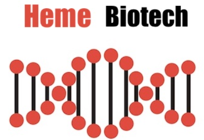

## Company Background

Heme Biotech is a small but highly respected company in the pharmaceutical sector. Their slogan is “finding cures for all our loved ones,” as they specialize in medications to treat blood disorders in both humans and animals.

## About the Project

As part of my coding internship with Heme Biotech, I have reviewed and fixed the code. The code allows data to be read from a text file in this use case a list of symptoms per line. The number of occurences are then counted and a new text file is generated called results.out which lists each symptom, followed by the number of occurences in the file.  
   
